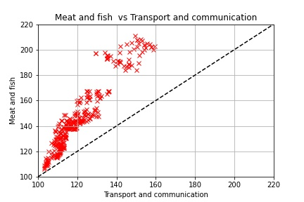
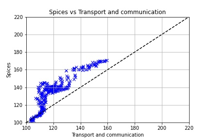

# DS200:Research Methods
* * *
## Module 4 : Assignment
* * *

> **Make a scatterplot, barchart and boxplot and draw inferences from dataset downloaded from www.data.gov.in**

### Dataset and files
> The dataset is <a href="#my_anchor">[1]</a> **All India Consumer Price Index (Rural/Urban) upto November 2021** and is  downloaded from www.data.gov.in.
>> The link to download the dataset is https://visualize.data.gov.in/?inst=a5df75bc-4578-48ad-bc9d-e6eb4b63de0a .  The data consists of consumer price index for various elements such items such as Cereals, Meat and Fish, Fruits, Healthcare products and many other products.
> All the files are contained in the zip folder **module4**
1.  **a5df75bc-4578-48ad-bc9d-e6eb4b63de0a.csv** is the csv file of the data set. The name is kept same as the name we see on downloading. 
2.  **consumer_index.py** in the github repository is the python script for the python code for plotting. 
3.  Copy **consumer_index.ipynb** is the jupyter notebook.

### Scatter Plots
> Here are a few scatter plots

1.This plot shows the relationship between consumer price index of meat and fish vs the transport and communication. As we can see it is increasing but not in a very linear fashion. 
2.Inference here is that as the transport and communication consumer price index increases so will the meat and fish consumer price index.

1.This plot shows the relationship between consumer price index of spices vs the transport and communication consumer price index. As we can see it is increasing but not in a very linear fashion. 
2.Inference here is that as the transport and communication consumer price index increases so will the Spices consumer price index. But sometimes there are sharp increases and sometimes smoother increases in the consumer price index value. 

1.This plot shows the relationship between consumer price index of meat and fish vs the transport and communication. As we can see it is increasing but not in a very linear fashion. 
2.Inference here is that as the transport and communication consumer price index increases so will the meat and fish consumer price index.

* * *

### Part2: - Box Plot
> Below are two boxplots.

1.  The plot on the left shows the box plot of **Number of complaints received by police** in two catergories. First the complaints which are submitted to police by other entities via oral,written means or using police helpline for all 35 states and U.Ts. Second are the complaints that are registered by police suomoto for all 35 states and U.Ts. The first boxplot shows the number of complaints on log scale along with the outliers.
2. The second boxplot shows the same data as (1) but on a linear scale without outliers.
#### The observations one can derive from the boxplots are the following:-
1.  Looking at (b) we can say that on an average more complaints are registered by outside entities than suomoto by law enforceres.
2.  The spread in number of complaints filed by non law enforcers is more. This category also has less outliers than the other.
3.  The complaints registered suomoto by law enforcers are very high compared to the IQR in a few States/UTs and hence have more outliers.

* * *
### Part3: - Bar Chart
> Below is the Barchart which shows for all States and U.Ts (those that existed in 2009) how many complaints are filed by non law enforcers and suomoto by police.

1.  The Bar chart shows on log10 scale the **number of complaints**. The **blue** bar denoted the **number of complaints  received by police via oral/written/helpline** and the **red** bar denoted the **number of complaints filed suomoto by police** for all 35 states and U.Ts .

#### The observations one can derive from the bar chart are the following:-

1.  Apart from T.N, Goa, U.P, A&N Islands and Uttarakhand in all states more complaints are recieved via oral/written/helpline means. This explains the higher average of number of complaints received via oral/written/helpline means in box plot.
2.  Although in most of states the number of suomoto complaints are considerably less than the other category, in some of them the number is closer or even higher than later. This explains the reason for high number of outliers.

## References
<b id="my_anchor">[1].</b> National Crime Records Bureau- Ministry of Home Affairs,2009, _State/UT-wise Complaints received by Police & Cases registered under IPC & SLL during 2009_, electronic dataset,Open Government Data (OGD) Platform India, [https://data.gov.in/resources/stateut-wise-complaints-received-police-cases-registered-under-ipc-sll-during-2009](https://data.gov.in/resources/stateut-wise-complaints-received-police-cases-registered-under-ipc-sll-during-2009).

