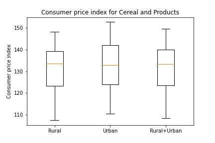

# DS200:Research Methods
* * *
## Module 4 : Assignment
* * *

> **Make a scatterplot, barchart and boxplot and draw inferences from dataset downloaded from www.data.gov.in**

### Dataset and files
> The dataset is <a href="#my_anchor">[1]</a> **All India Consumer Price Index (Rural/Urban) upto November 2021** and is  downloaded from www.data.gov.in.
>> The link to download the dataset is https://visualize.data.gov.in/?inst=a5df75bc-4578-48ad-bc9d-e6eb4b63de0a .  The data consists of consumer price index for various elements such items such as Cereals, Meat and Fish, Fruits, Healthcare products and many other products.
> All the files are contained in the zip folder **module4**
1.  **a5df75bc-4578-48ad-bc9d-e6eb4b63de0a.csv** is the csv file of the data set. The name is kept same as the name we see on downloading. 
2.  **consumer_index.py** in the github repository is the python script for the python code for plotting. 
3.  **consumer_index.ipynb** is the jupyter notebook.

### Scatter Plots
> Here are a few scatter plots
 

  
 

1.This plot shows the relationship between consumer price index of meat and fish vs the transport and communication. As we can see it is increasing but not in a very linear fashion. 
2.Inference here is that as the transport and communication consumer price index increases so will the meat and fish consumer price index.

  
 

1.This plot shows the relationship between consumer price index of spices vs the transport and communication consumer price index. As we can see it is increasing but not in a very linear fashion. 
2.Inference here is that as the transport and communication consumer price index increases so will the Spices consumer price index. But sometimes there are sharp increases and sometimes smoother increases in the consumer price index value. 

  
 

1.This plot shows the relationship between consumer price index of clothing and housing vs the transport and communication. As we can see it is increasing but at different rates
2.Clothing increases and the rate of increase is higher for higher value of consumer price index for transport and communication. Maybe due to more transport people are able to buy clothes more but housing is not so easy to purchase so transport may only affect it to a certain extent. 

* * *

### Box Plot

  

1.  The plot shows the variation of consumer price index for cereals and products for different sectors Rural, Urban and Rural+Urban 
2.  We notice that the spraed is almost same for all except for Urban which show higher spread. 
3.  The median consumer price index is higher in Rural as compared to Urban and Rural+Urban 
4.  The Maximum and minimum values of consimer price index is higher than that for rural and rural+urban. 

* * *
### Line Graph

  

1.  The line graph shows the variation of the consumer price index for the month of July from 2013 to 2021 for three different sectors Rural, Urban and Rural+Urban. 
2.  We can see that the consumer index is highest for Rural , followed by Rural + Urban and then followed by Urban .
3.  Primarily this which could indicate that inflation is higher in the rural areas. This could be a combination of many reasons, it may also be related to export and import regulatory rules. 

## References
<b id="my_anchor">[1].</b>  All India Consumer Price Index (Rural/Urban) upto November 2021, [https://visualize.data.gov.in/?inst=a5df75bc-4578-48ad-bc9d-e6eb4b63de0a]

