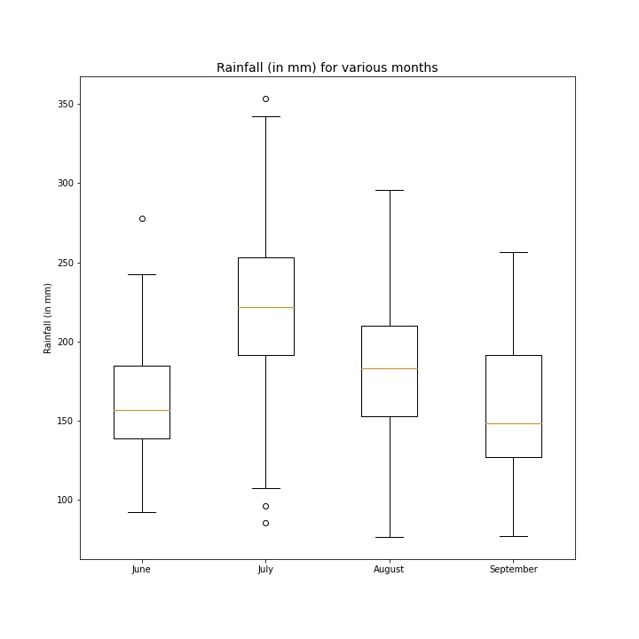
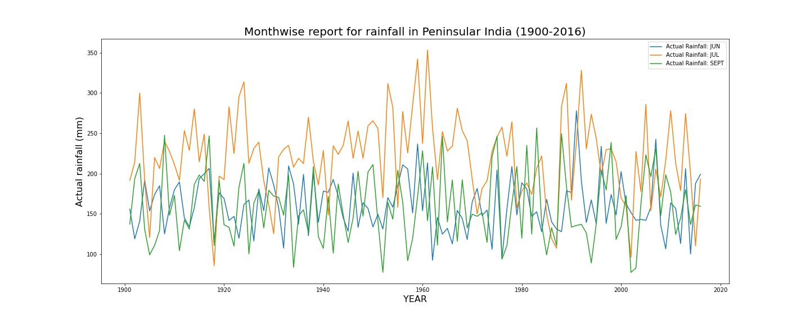
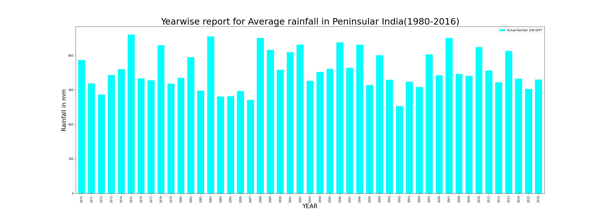

# DS200:Research Methods
* * *
## Module 4 : Assignment
* * *

> **Make a scatterplot, barchart and boxplot and draw inferences from dataset downloaded from www.data.gov.in**

### Dataset and files
> The dataset is <a href="#my_anchor">[1]</a> **Rainfall in South Peninsula And its Departure for Monsoon Session (June-Septemebr) from 1901-2016** and is  downloaded from www.data.gov.in.
>> The link to download the dataset is https://data.gov.in/resource/rainfall-south-peninsula-10-subdivisions-and-its-departure-normal-monsoon-session-june-0 .  The data consists of consumer price index for various elements such items such as Cereals, Meat and Fish, Fruits, Healthcare products and many other products.
> All the files are contained in the zip folder **module4**
1.  **south_pen-India_rainfall_act_dep_1901_2016.csv** is the csv file of the data set. The name is kept same as the name we see on downloading. 
2.  **rainfall_peninsula_2016.py** in the github repository is the python script for the python code for plotting. 
3.  **rainfall_peninsula_2016.ipynb** is the jupyter notebook.

### Scatter Plots
> Here are a few scatter plots
 

  
 

 

1.This plot shows the variation of the rainfall in July vs rainfall in June and rainfall in August vs rainfall in June to see if there is a correlation between months

2.In general no correlation can be seen but if we were to describe it simply, we could say it is approximately increasing 

3.At higher values of rainfall in June, we dont see that high a rainfall in July. 
4. Around 200-250 range of rainfall in June , we see a peak in rainfall in both July and August. This could be a way to characterize the monsoon currents. 

* * *

### Box Plot

  

1.  This plot shows statistics for rainfall for various months from 1900-2016.
2.  We see that July in general has the highest values for median, maximum and minimum.
3.  September has the lowest median value and this may indicate the end of monsoon. 
4.  September also has the highest interquartile range so some years may experience good rainfall in Septmber as compared to June while some years may not see as good      rains in Septmber compared to June 
5.  August is the second in terms of the median rainfall across 116 years
6.  June has the lowest range of values. Its values of rainfall are more consistent as compared to the other months. 

* * *
### Line Plot

  

1.This plot shows the variation of the rainfall across many years for the months June, July, September.

2.Inference here is that as the in general the rainfall in July is higher than that of June and September. While comparing rainfall between June and September it is not so clear which month has higher rainfall from this graph but September has lower dips compared to the June. 

3.Across various years there is no clear trend and the rainfall seems to be constant although the peak rainfall years are before 2000. 

* * *
### Bar Plot

  

1. This is a plot showing the variation of total rainfall (June to September) across various years from 1970 to 2016. Each bar indicatest the total rainfall in millimetres(mm).
2. There is no general trend that can be seen although the highest rainfall is seen at 1974 and lowest rainfall is seen at 2002. 
3. Between 1988 to 2000 we see it has more peaks in the plot so these years may have seen good rainfall. as compared to other series of years. 

* * *

## References
<b id="my_anchor">[1].</b>  All India Consumer Price Index (Rural/Urban) upto November 2021, [https://data.gov.in/resource/rainfall-south-peninsula-10-subdivisions-and-its-departure-normal-monsoon-session-june-0]
