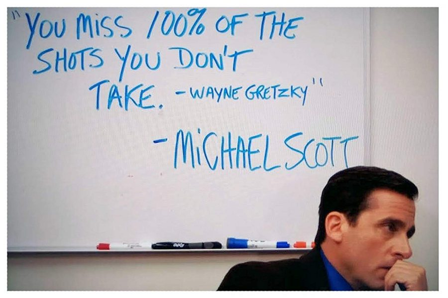

## About

 

  I am currently a Masters' student at the <b>Indian Institute Of Science</b>. I work under <b>Dr.Sashikumaar Ganesan</b> in the <b> Computational Mathematics Group </b> at the <b> Department of Computational and Data Sciences </b>. Prior to this I worked in <b> Dassault Systemes </b> as a Software developer. My complete <b>resume</b> can be found <a href= "pdf/RESUME_mahesh.pdf" target="blank"><b>here</b></a>.

---

## DS 200 : Research Methods Assignment 

The objective of this assignment is to generate plots using matplotlib library and draw some inference from the data.The dataset used is All India Consumer Price Index from January 2021 to November 2021. It is available at <a href="https://visualize.data.gov.in/?inst=a5df75bc-4578-48ad-bc9d-e6eb4b63de0a#" target="blank">https://www.data.gov.in</a>. Here we use box plot, scatter plot and line plot for drawing some inference from the data. [[Github Page](https://github.com/adityarastogi2k12/ds200){:target="_blank"}] [[Results](DS200_research/README.md)]

---

## Work Experience 

### Indian Institute Of Science
####  (August 2022-December 2022)

I am currently a teaching assistant for DS:226 Introduction to Computing for Artificial Intelligence and Machine Learning at <a href="https://www.iisc.ac.in" target="blank">IISc</a>, Bengaluru where I design and evaluate questions for quizzes, assignments and exams.  

### Dassault Systemes
####  (June 2018 - July 2021)

I worked as a software developer in <a href="https://www.3ds.com/" target="blank">Dassault Systemes</a>  where I developed code mainly related to <a href="https://www.3ds.com/cloud?utm_medium=cpc&utm_source=google&utm_campaign=202201_glo_sea_en_op51508_labl_brand_ind_exact&utm_term=3dexperience-exact&utm_content=search&gclid=Cj0KCQjwmouZBhDSARIsALYcoup9Z2tM7-u2sL1M2VDR4vlblvzp9jF0xc3fEIEZb7XJGvuKkq6Jgc8aAs_ZEALw_wcB">3DExperience</a>. I was also responsible for maintenance and testing of code. I developed many new functionalities to support customers like Michelin, Dassault Aviation and Mercedes Benz.

   

---
## Favorite quotes

   

   

   

---

<!--- ### Category Name 2

- [Project 1 Title](http://example.com/)
- [Project 2 Title](http://example.com/)
- [Project 3 Title](http://example.com/)
- [Project 4 Title](http://example.com/)
- [Project 5 Title](http://example.com/) --->

---

---

Page template forked from <a href="https://github.com/evanca/quick-portfolio">evanca</a>

<!-- Remove above link if you don't want to attibute -->
